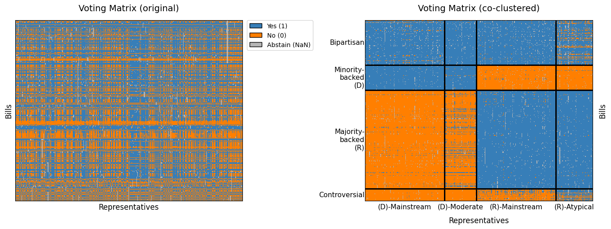
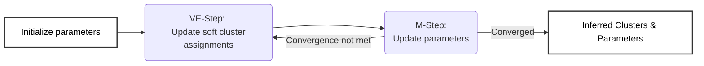

# hyper-vem


> Simultaneous clustering of both nodes and group interactions in higher-order networks using a Variational Expectation-Maximization algorithm.

This repository implements a scikit-learn compatible Variational Expectation-Maximization (VEM) algorithm for co-clustering higher-order networks (hypergraphs), where interactions involve groups rather than pairs. It jointly clusters nodes and interactions, and is demonstrated on roll-call voting data from the 119th U.S. House of Representatives

<p align="center">
  
  <br>
  <em>Figure 1: Raw (left) and co-clustered (right) voting matrix of the 119th U.S. House of Representatives.</em>
</p>

## Key Features

* Standard `scikit-learn` estimator API compatibility, allowing integration with tools like `GridSearchCV` for parallelized model selection.
* Vectorized VE and M-steps using `NumPy` matrix operations.
* Support for hypergraphs with missing values (`NaN`) as well as sparse matrices.
* Custom plotting functions for visualizing the inferred cluster structure.


> **Note:** The underlying model and VEM update rules were derived as part of the MSc thesis *Co-clustering on Binary Hypergraphs*.
---
## Table of Contents
- [Installation](#installation)
- [Quick start](#quick-start)
- [Overview: Why Hypergraphs?](#overview-why-hypergraphs)
- [Model](#model)
- [Variational Expectation-Maximization](#variational-expectation-maximization)
- [Model selection](#model-selection)
- [Applications](#applications)
- [Example: Congressional Voting Analysis](#example-congressional-voting-analysis)
- [License](#license)

## Installation

The project was developed and tested on Python 3.11.

**Clone the repository:**

```bash
git clone https://github.com/i-Liolios/hyper-vem.git
cd hyper-vem
```
**Install the packages:**

```bash
# standard installation
pip install .

# Optional: Install with testing and KModes initialization support
pip install .[kmodes,test]
```
**Requirements:**
```txt
matplotlib>=3.6.2
numpy>=1.23.5
pandas>=2.3.3
scikit-learn>=1.8.0
scipy>=1.17.0
seaborn>=0.13.2
```

## Quick start 

```python
from hypervem import HypergraphCoClustering

# Fit model on an existing incidence matrix X
model = HypergraphCoClustering(n_node_clusters=2, n_hyperedge_clusters=2, n_init=3, random_state=42)
model.fit(X)

# Access results
model.node_clusters_
model.hyperedge_clusters_
model.connection_probabilities_
```
## Overview: Why Hypergraphs?

Standard networks model only pairwise interactions. However, real-world interactions often involve groups (hyperedges):

- Shopping baskets: multiple items bought together  
- Research papers: multiple co-authors on a paper
- Legislative votes: multiple legislators voting on a bill  

A hypergraph preserves these interactions using a **binary incidence matrix** `X` (shape: `n_hyperedges × n_nodes`):

| | Node 1 | Node 2 | Node 3 | Description |
|---|:---:|:---:|:---:|---|
| **Hyperedge 1** | 1 | 1 | 0 | Pairwise interaction between Node 1 & 2 |
| **Hyperedge 2** | 1 | 1 | 1 | Higher-order interaction between all nodes |

- `X[j, i] = 1` if node i participates in hyperedge j, else 0
- A hyperedge is simply a set of nodes participating in the same interaction

## Model

The model is defined by a two-step mixture model:

1. Each Node belongs to a latent cluster $$k$$ with probability $\gamma_k$, $$k \in \\\{1, ..., K\\\}$$  (e.g., "Rock Music Fans").

2. Each Hyperedge belongs to a latent cluster $$g$$ with probability $\delta_g$, $$g \in \\\{1, ..., G\\\}$$ (e.g., "Rock Concerts", "Symphonies").

3. Each node decides whether to join each hyperedge by performing a Bernoulli trial with parameter $\theta_{k,g}$.

**Example:** A "Rock music fan" has a high probability of joining a "Rock Concert" hyperedge, but a low probability of joining a "Symphony" hyperedge.

The number of node/hyperedge clusters $G,K$ are user-specified hyperparameters. They can be inferred through [model selection](#model-selection). 

## Variational Expectation-Maximization

We iteratively maximize a lower bound (ELBO) of the log-likelihood using coordinate ascent:

- **VE-step**: Update soft cluster assignments 
- **M-step**: Update model parameters (weights and connection probabilities)
- Repeat until convergence

Both steps have closed-form updates available in `math.md`.

**Input:**
- **Incidence Matrix** `X`, shape (M, N)
* Hyperparameters:
  - `K` = number of node clusters (`n_node_clusters`)
  - `G` = number of hyperedge clusters (`n_hyperedge_clusters`)

**Output:**  
| Attribute | Shape | Description |
| :--- | :--- | :--- |
| `node_responsibilities_` | $(N, K)$ | Soft cluster assignments for nodes. |
| `hyperedge_responsibilities_` | $(M, G)$ | Soft cluster assignments for hyperedges. |
| `node_clusters_` | $(N,)$ | Hard cluster assignments for nodes (argmax of responsibilities). |
| `hyperedge_clusters_` | $(M,)$ | Hard cluster assignments for hyperedges (argmax of responsibilities). |
| `node_weights_` | $(K,)$ | Estimated mixing proportions of node clusters. |
| `hyperedge_weights_` | $(G,)$ | Estimated mixing proportions of hyperedge clusters. |
| `connection_probabilities_` | $(K, G)$ | Probability matrix of participation between node clusters and hyperedge clusters. |

Visual diagram of the VEM:



**Complexity:**
- **Dense incidence matrix** `X`:  
  `O(M · N · K · G)`

- **Sparse incidence matrix** `X`:  
  `O(nnz(X) · K · G)`, where `nnz(X)` is the number of non-zero entries


## Model selection

Choose the number of node clusters `K` and hyperedge clusters `G` using the **Integrated Completed Likelihood (ICL)**.  
GridSearchCV is used only to **parallelize the search**, not for cross-validation, as the ICL is an information criterion.

```python
from hypervem import HypergraphCoClustering
from sklearn.model_selection import GridSearchCV

param_grid = {'n_node_clusters': range(1,5),
              'n_hyperedge_clusters': range(1,5)}

# Use a single “train=test” split for ICL (no CV)
grid = GridSearchCV(HypergraphCoClustering(random_state=42),
                    param_grid=param_grid,
                    cv=[(range(X.shape[0]), range(X.shape[0]))])
grid.fit(X)

best_model = grid.best_estimator_
```

## Project Structure

The project is organized as a Python package (`hypervem`) with separate directories for tests, notebooks, and executable scripts.

```text
hypervem_project/
├── hypervem/                  # Source code 
├── examples/                  # Scripts to produce synthetic experiments
├── notebooks/                 # Interactive analysis 
├── tests/                     # Unit tests
└── setup.py                   # Installation configuration
```

## Testing

This repository includes a suite of unit tests located in the `tests/` directory.

To run the tests, install pytest and execute:
```bash
pip install pytest
pytest tests/
```
## Applications

Some potential application areas of the model:

- **E-commerce**: Identify consumer profiles from simultaneous product bundle purchases.  
- **Governance**: Uncover legislative voting blocs and bill categories from co-sponsorship data (see [example](#example-congressional-voting-analysis)).

## Example: Congressional Voting Analysis

The model was applied to roll-call voting data from the **119th U.S. House of Representatives**:

- **Nodes**: 439 representatives  
- **Hyperedges**: 361 bills  

A node joining a hyperedge corresponds to a **“Yes”** vote.

The model jointly identifies blocs of legislators and categories of legislation at multiple resolutions.

- **Reproducible notebook**: `/notebooks/voting_analysis.ipynb`


## License

This project is licensed under the MIT License - see the [LICENSE](LICENSE) file for details.

